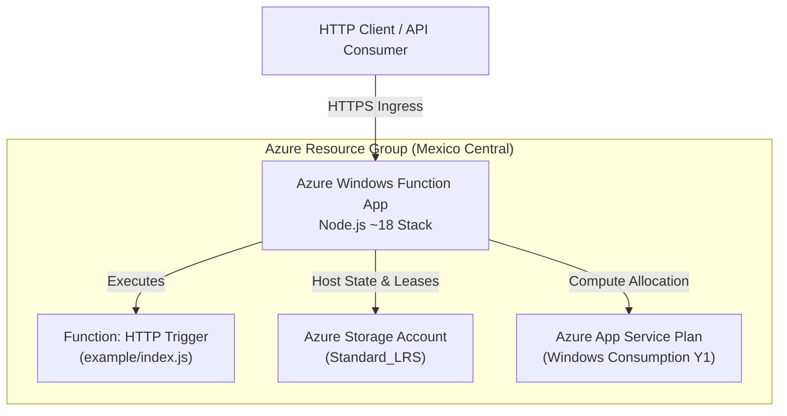

# Azure Function Serverless Infrastructure with Terraform

## Overview

This repository provides an automated Infrastructure as Code (IaC) solution using HashiCorp Terraform to provision and manage a serverless application stack on Microsoft Azure. The infrastructure deploys an Azure Windows Function App configured with a Node.js runtime, an associated Azure Storage Account for internal runtime state, a Consumption App Service Plan, and an HTTP-triggered serverless function running sample application code.

The default deployment region is configured for **Mexico Central** (`mexicocentral`).

---

## Architectural Design

The architecture is structured around standard Azure serverless reference patterns, isolating the compute and storage boundaries within a dedicated Resource Group.



### Deployed Resources

1. **Azure Resource Group (`azurerm_resource_group`)**: Serves as the administrative and lifecycle boundary for all associated assets.
2. **Azure Storage Account (`azurerm_storage_account`)**: Provides backing blob, queue, and table storage required by the Azure Functions host runtime for triggers, execution logs, and distributed locks.
3. **Azure Service Plan (`azurerm_service_plan`)**: Deployed under the Consumption tier (`Y1`) on Windows OS, providing dynamic serverless scaling where compute resources are allocated strictly upon request execution.
4. **Azure Windows Function App (`azurerm_windows_function_app`)**: The serverless hosting platform configured with the Node.js `~18` runtime stack.
5. **Azure Function App Function (`azurerm_function_app_function`)**: An individual HTTP-triggered function loaded directly from source code (`example/index.js`), supporting `GET` and `POST` methods with anonymous access level.

---

## Architecture Evolution and Refactoring Summary

The codebase has undergone refactoring to elevate it from a flat demonstration script to an enterprise-ready, modular architecture adhering to HashiCorp and Microsoft Azure best practices:

- **Modular Decomposition**: Resource definitions have been decoupled from the root scope and encapsulated within a reusable child module (`modules/function_app`). This separation allows the Function App subsystem to be instantiated multiple times across various environments or shared repositories.
- **Strict Naming Compliance**: Azure Storage Accounts enforce strict naming restrictions (3 to 24 lowercase alphanumeric characters without special symbols). The refactored module incorporates automated sanitization logic to derive valid storage names while offering explicit override controls.
- **Regional Alignment**: Standardized resource placement to the **Mexico Central** region across all resource declarations and default variable values.
- **Provider Pinning**: Added `versions.tf` to lock minimum Terraform CLI versions (`>= 1.0.0`) and constrain the `azurerm` provider version (`~> 3.0`), ensuring predictable execution across CI/CD runners and local workstations.
- **Variable Management**: Replaced hardcoded declarations with comprehensive typing, explicit descriptions, sensible defaults, and a ready-to-use variable definition template (`terraform.tfvars.example`).
- **Standardized Outputs**: Root and module outputs expose critical operational metadata including function invocation URLs, default hostnames, and resource identifiers.

---

## Repository Structure

```text
.
├── .gitignore                      # Git exclusion rules for local state and sensitive tfvars
├── README.md                       # Repository documentation
├── example/
│   └── index.js                    # Sample Node.js HTTP trigger function source
├── main.tf                         # Root entry point: provider, resource group, module instantiation
├── variables.tf                    # Root input variable definitions
├── outputs.tf                      # Root output values and function endpoints
├── versions.tf                     # Terraform CLI and provider constraints
├── terraform.tfvars.example        # Reference variable configuration file
└── modules/
    └── function_app/
        ├── main.tf                 # Module resource declarations (Storage, Plan, App, Function)
        ├── variables.tf            # Module input variable specifications
        └── outputs.tf              # Module outputs for parent consumption
```

---

## Prerequisites

Before executing the configuration, verify that your environment satisfies the following requirements:

1. **HashiCorp Terraform**: Version `1.0.0` or higher installed locally.
2. **Azure CLI (`az`)**: Version `2.40.0` or higher installed.
3. **Azure Subscription**: Active subscription with permissions to create Resource Groups, Storage Accounts, and Function Apps (e.g., `Contributor` or `Owner` role).

---

## Configuration and Variables

### Input Variables

| Variable Name          | Type          | Default            | Description                                                                                                             |
| :--------------------- | :------------ | :----------------- | :---------------------------------------------------------------------------------------------------------------------- |
| `name_function`        | `string`      | _(Required)_       | Base name for the Function App and associated infrastructure.                                                           |
| `location`             | `string`      | `"Mexico Central"` | Azure region where resources are deployed.                                                                              |
| `environment`          | `string`      | `"dev"`            | Deployment stage identifier (e.g., `dev`, `staging`, `prod`).                                                           |
| `storage_account_name` | `string`      | `null`             | Optional explicit name for the Storage Account (3-24 lowercase alphanumeric characters). Derived automatically if null. |
| `tags`                 | `map(string)` | See `variables.tf` | Map of key-value tags assigned to all provisioned resources.                                                            |

### Module Inputs (`modules/function_app`)

| Variable Name                | Type          | Default              | Description                                           |
| :--------------------------- | :------------ | :------------------- | :---------------------------------------------------- |
| `resource_group_name`        | `string`      | _(Required)_         | Target Resource Group name.                           |
| `location`                   | `string`      | `"Mexico Central"`   | Azure region.                                         |
| `function_name`              | `string`      | _(Required)_         | Base name for the Function App.                       |
| `function_app_function_name` | `string`      | `null`               | Function resource name (defaults to `function_name`). |
| `storage_account_name`       | `string`      | `null`               | Optional explicit storage account name.               |
| `service_plan_name`          | `string`      | `null`               | Optional explicit service plan name.                  |
| `storage_account_tier`       | `string`      | `"Standard"`         | Storage Account tier.                                 |
| `storage_replication_type`   | `string`      | `"LRS"`              | Storage replication strategy.                         |
| `os_type`                    | `string`      | `"Windows"`          | Operating system for the Service Plan.                |
| `sku_name`                   | `string`      | `"Y1"`               | Service Plan pricing tier.                            |
| `node_version`               | `string`      | `"~18"`              | Node.js runtime version.                              |
| `function_source_file`       | `string`      | `"example/index.js"` | Path to the JavaScript code file.                     |
| `tags`                       | `map(string)` | `{}`                 | Resource tags.                                        |

### Output Values

| Output Name                     | Type     | Description                                         | Sensitive |
| :------------------------------ | :------- | :-------------------------------------------------- | :-------- |
| `url`                           | `string` | HTTP invocation URL for the deployed function.      | No        |
| `function_invocation_url`       | `string` | Full HTTP trigger invocation URL.                   | No        |
| `function_app_name`             | `string` | Name of the provisioned Azure Windows Function App. | No        |
| `function_app_default_hostname` | `string` | Default hostname of the Function App.               | No        |
| `resource_group_name`           | `string` | Name of the provisioned Azure Resource Group.       | No        |
| `storage_account_name`          | `string` | Name of the storage account used by the runtime.    | No        |

---

## Deployment Procedure

### 1. Authenticate with Azure

Log in to your Azure tenant and verify the active subscription:

```bash
az login
az account show --output table
```

If you manage multiple subscriptions, set the desired subscription:

```bash
az account set --subscription "<SUBSCRIPTION_ID_OR_NAME>"
```

### 2. Configure Variable Values

Initialize your environment variables file from the provided example template:

```bash
cp terraform.tfvars.example terraform.tfvars
```

Edit `terraform.tfvars` with your desired configuration:

```hcl
name_function = "func-corp-mx-01"
location      = "Mexico Central"
environment   = "dev"

tags = {
  Environment = "dev"
  ManagedBy   = "Terraform"
  Project     = "azure-function-test"
  Owner       = "Platform-Team"
}
```

### 3. Initialize Working Directory

Download required provider plugins and initialize child modules:

```bash
terraform init
```

### 4. Code Formatting and Syntax Validation

Verify that all files comply with Terraform canonical styling and valid schema:

```bash
terraform fmt -check -recursive
terraform validate
```

### 5. Generate and Review Execution Plan

Create a speculative execution plan and review the resources to be provisioned:

```bash
terraform plan -out=tfplan
```

### 6. Apply Configuration

Provision the infrastructure to Azure:

```bash
terraform apply tfplan
```

Upon successful completion, Terraform displays the outputs, including the function invocation URL:

```text
Apply complete! Resources: 5 added, 0 changed, 0 destroyed.

Outputs:

function_app_default_hostname = "func-corp-mx-01.azurewebsites.net"
function_app_name = "func-corp-mx-01"
function_invocation_url = "https://func-corp-mx-01.azurewebsites.net/api/func-corp-mx-01"
resource_group_name = "func-corp-mx-01"
storage_account_name = "funccorpmx01"
url = "https://func-corp-mx-01.azurewebsites.net/api/func-corp-mx-01"
```

---

## Testing and Verification

Once deployed, verify the HTTP function endpoint using `curl` or any API testing client.

### GET Request with Query Parameter

```bash
curl -X GET "https://<FUNCTION_APP_HOSTNAME>/api/<FUNCTION_NAME>?name=DevOps"
```

Expected Response:

```json
{ "id": "DevOps" }
```

### POST Request with JSON Body

```bash
curl -X POST "https://<FUNCTION_APP_HOSTNAME>/api/<FUNCTION_NAME>" \
     -H "Content-Type: application/json" \
     -d '{"name": "Engineering"}'
```

Expected Response:

```json
{ "id": "Engineering" }
```

### Request Without Parameters

```bash
curl -X GET "https://<FUNCTION_APP_HOSTNAME>/api/<FUNCTION_NAME>"
```

Expected Response:

```text
This HTTP triggered function executed successfully. Pass a name in the query string or in the request body for a personalized response.
```

---

## Infrastructure Teardown

To release all provisioned cloud resources and prevent ongoing consumption charges:

```bash
terraform destroy
```

Alternatively, review the destruction plan prior to deletion:

```bash
terraform plan -destroy -out=destroy.tfplan
terraform apply destroy.tfplan
```

---

## Best Practices and Operational Guidelines

### 1. Remote State Management

In multi-engineer teams and automated pipelines, local state files (`terraform.tfstate`) must not be used. Store state remotely in an Azure Storage Account with state locking via Azure Blob Storage:

```hcl
terraform {
  backend "azurerm" {
    resource_group_name  = "rg-terraform-state"
    storage_account_name = "sttfstatemx"
    container_name       = "tfstate"
    key                  = "serverless/azure-function.tfstate"
  }
}
```

### 2. Secret and Credential Handling

- Do not commit `.tfvars` files containing credentials to version control. The `.gitignore` file in this repository excludes all `*.tfvars` files by default while tracking `*.tfvars.example`.
- In production, prefer Azure Managed Identities (`SystemAssigned` or `UserAssigned`) over storage access keys for resource authentication.

### 3. Continuous Integration and Delivery (CI/CD)

When deploying via automated pipelines (e.g., GitHub Actions, Azure DevOps, GitLab CI):

- Utilize OpenID Connect (OIDC) federated credentials rather than long-lived client secrets.
- Execute `terraform fmt -check`, `terraform validate`, and static analysis tools on pull requests.
- Enforce mandatory peer approvals on `terraform apply` stages.

### 4. High Availability and Disaster Recovery

For production workloads requiring business continuity:

- Evaluate geo-redundant storage (`GRS` or `ZRS`) for the backing Storage Account.
- Consider deploying across paired regions or implementing Azure Front Door for multi-region active-passive failover.
